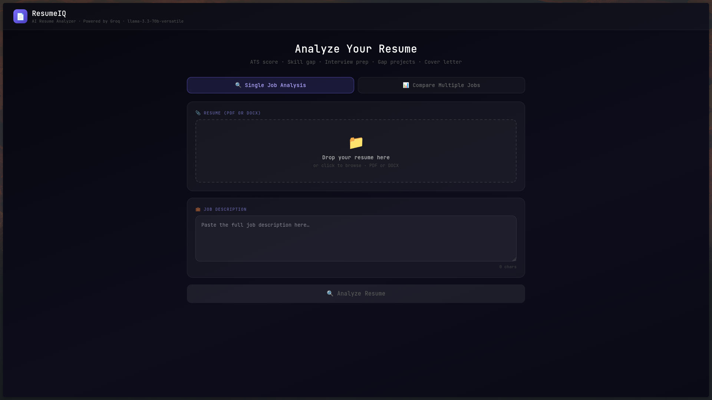

<div align="center">

# 📄 Calibre

### AI-powered resume analyzer that helps you land more interviews

[](https://resume-iq-three-rho.vercel.app)
[](https://fastapi.tiangolo.com)
[](https://react.dev)
[](https://groq.com)

**Calibre** analyzes your resume against any job description in seconds.
Get an ATS score, skill gap breakdown, predicted interview questions,
gap projects, and a tailored cover letter — all powered by Groq's blazing-fast Llama 3.3 70B.

[**Try it live →**](https://calibre-rho.vercel.app)



</div>

---

## ✨ Features

| Feature | Description |
|---|---|
| 📊 **ATS Score** | Match percentage against the job description |
| ✅ **Skill Gap Analysis** | Matched vs missing skills at a glance |
| 🎤 **Interview Prep** | Predicted questions with personalized talking points |
| ⚡ **Gap Projects** | Concrete projects to build missing skills authentically |
| ✉️ **Cover Letter** | Personalized, cliché-free cover letter in seconds |
| ✍️ **Resume Rewriter** | Section-by-section JD-tailored rewrites |
| 📊 **Multi-Job Compare** | Rank multiple JDs against one resume |
| 📎 **PDF + DOCX** | Supports both file formats |

---

## 🏗️ Architecture
Browser (React + Vite)

↓

/api/* (Vercel rewrites)

↓

FastAPI Backend (Railway)

↓

utils/ai_provider.py

↓

Groq API (llama-3.3-70b-versatile)

> The frontend **never calls Groq directly**. All AI logic is isolated in `backend/utils/ai_provider.py`, making it trivial to swap providers.

---

## 🚀 Tech Stack

**Frontend**
- React 18 + Vite
- Pure CSS-in-JS (no UI library)
- Deployed on Vercel

**Backend**
- FastAPI + Python 3.13
- pdfplumber (PDF parsing)
- python-docx (DOCX parsing)
- Deployed on Railway

**AI**
- Groq Cloud — llama-3.3-70b-versatile
- Provider-agnostic layer (swap to OpenAI, Anthropic, Gemini with one env var)

---

## 🔄 Switching AI Providers

Only two changes needed — no code modifications:

```bash
# In backend/.env
AI_PROVIDER=openai        # or anthropic, gemini, openrouter
OPENAI_API_KEY=sk-...
```

Supported providers:

| Provider | Models |
|---|---|
| `groq` | llama-3.3-70b-versatile (default) |
| `openai` | gpt-4o-mini (default) |
| `anthropic` | claude-haiku-4-5 (default) |
| `gemini` | gemini-1.5-flash (default) |
| `openrouter` | meta-llama/llama-3.3-70b-instruct (default) |

---

## 🛠️ Running Locally

### Prerequisites
- Python 3.10+
- Node.js 18+
- Groq API key (free at [console.groq.com/keys](https://console.groq.com/keys))

### Backend

```bash
cd backend
python -m venv venv
source venv/bin/activate
pip install -r requirements.txt
cp .env.example .env
# Add your GROQ_API_KEY to .env
uvicorn app:app --reload --port 8000
```

### Frontend

```bash
cd frontend
npm install
npm run dev
```

---

## 📁 Project Structure
resumeiq/

├── frontend/

│   ├── src/

│   │   ├── main.jsx          # React entry point

│   │   └── App.jsx           # Main component — calls /api/* only

│   ├── index.html

│   ├── package.json

│   ├── vercel.json           # Rewrites /api/* → Railway backend

│   └── vite.config.js

├── backend/

│   ├── utils/

│   │   └── ai_provider.py    # ← Only file that knows about Groq

│   ├── app.py                # FastAPI routes + file parsing

│   ├── Procfile              # Railway start command

│   ├── requirements.txt

│   └── .env.example

├── .gitignore

└── README.md

---

## 🌐 Deployment

| Service | Platform | URL |
|---|---|---|
| Frontend | Vercel | https://resume-iq-three-rho.vercel.app |
| Backend | Railway | https://resumeiq-production-0acf.up.railway.app |

---

## 📄 License

All rights reserved. This code is proprietary. No permission is granted to copy, modify, distribute, or use this code without explicit written consent from the author.

---

<div align="center">
Built by <a href="https://github.com/R0-N1n">Ashmit</a>
</div>
